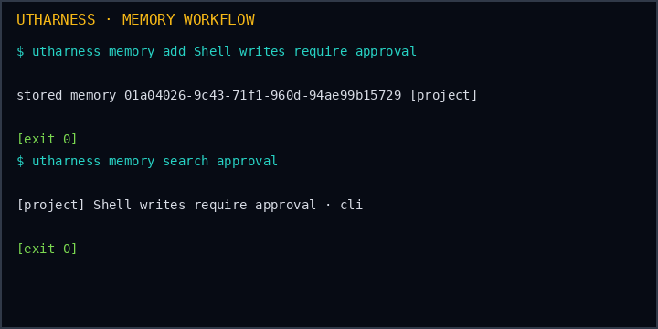
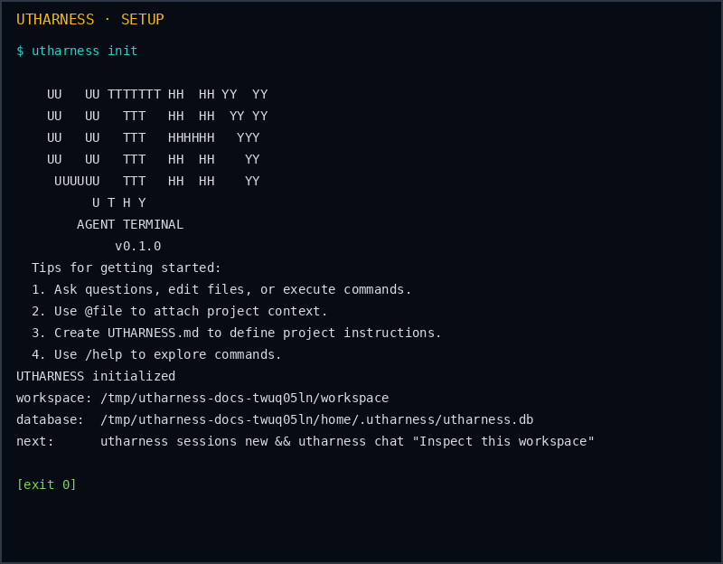
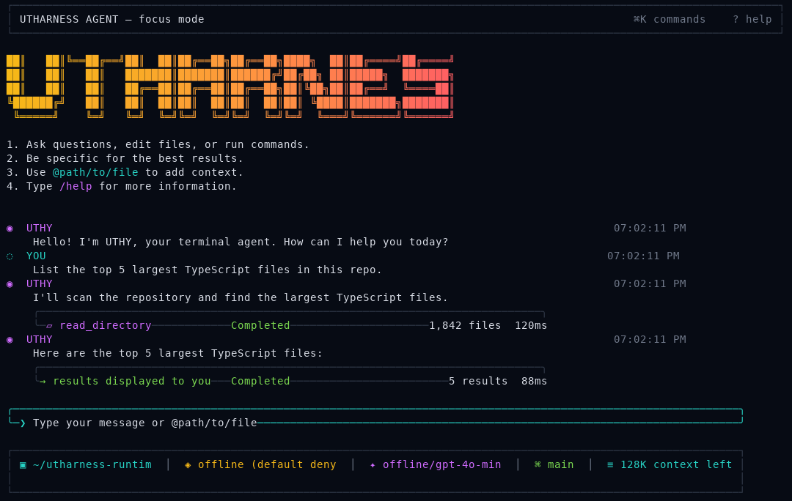
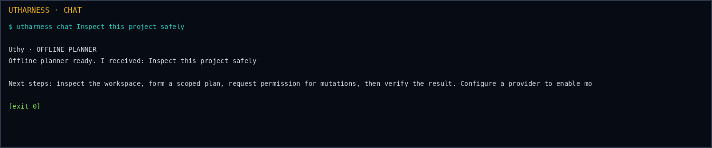
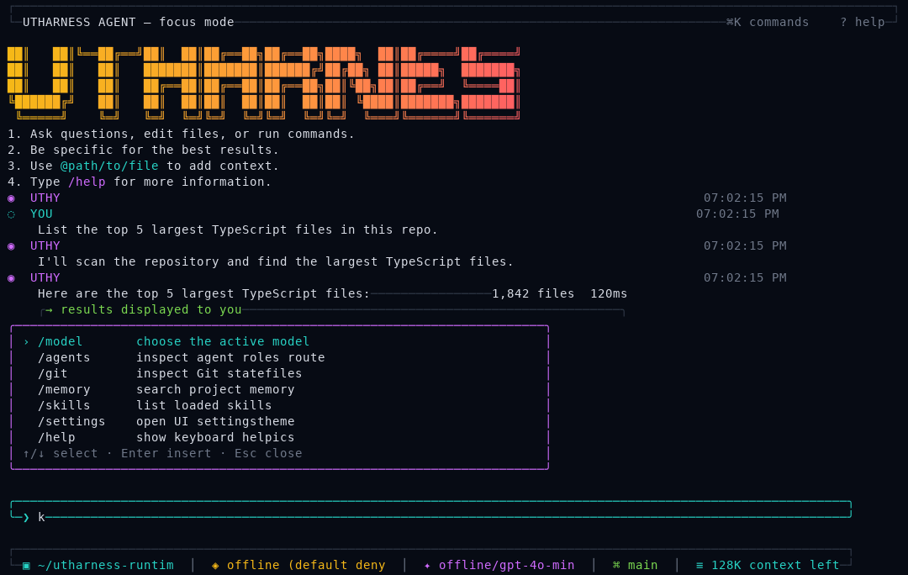
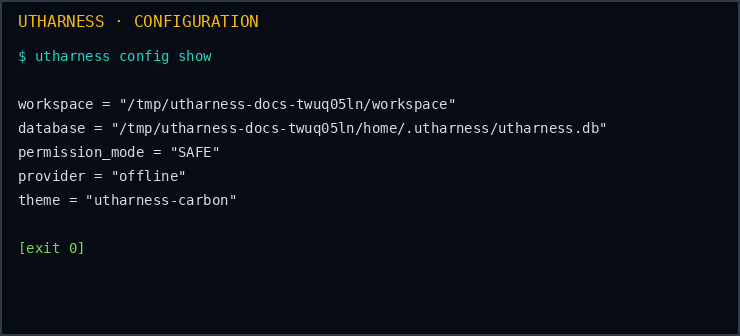
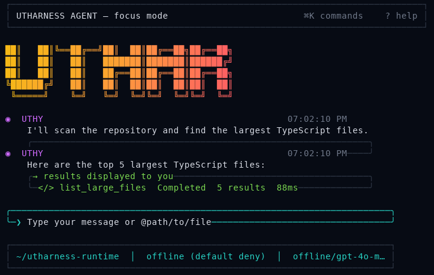
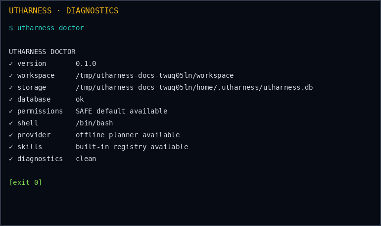
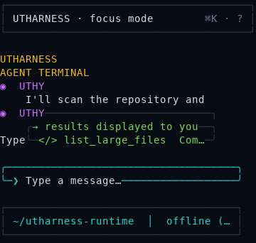

# UTHARNESS

[](https://github.com/uthumany/utharnessly/actions/workflows/ci.yml)
[](https://github.com/uthumany/utharnessly/actions/workflows/security.yml)
[](./LICENSE)

```text
██╗   ██╗████████╗██╗  ██╗
██║   ██║╚══██╔══╝██║  ██║
██║   ██║   ██║   ███████║
██║   ██║   ██║   ██╔══██║
╚██████╔╝   ██║   ██║  ██║
 ╚═════╝    ╚═╝   ╚═╝  ╚═╝

      U T H A R N E S S
        AGENT TERMINAL
```

**Utharness** is a local-first autonomous AI agent terminal. It combines a native Rust runtime, SQLite persistence, a conservative SAFE execution boundary, a scriptable CLI, and a reference-matched React/Ink terminal interface. The project is designed to be inspectable, reproducible, and useful both offline and with an explicitly configured provider.

> **Current status:** the repository is public and ships the working offline-first runtime, native CLI, bounded autonomous inspection path, persistent SQLite journal, and bundled TypeScript/Ink TUI. Provider streaming, broader autonomous tool execution, and native packages for every operating system remain subsequent milestones.

## Installation methods

The copyable installation entrypoint is [`INSTALLATION.md`](./INSTALLATION.md). It includes npm, npx, pnpm, pnpx, Bun, PyPI, pipx, uv, curl, PowerShell, Git source builds, runtime managers, and an explicit matrix for unavailable package channels. The package source manifests are [`packages/utharnessly-npm`](./packages/utharnessly-npm) and [`python/utharnessly`](./python/utharnessly).

```bash
# npm
npm install --global utharnessly
utharness --version

# npx
npx --yes utharnessly --help

# PyPI
python -m pip install utharnessly
utharness --version

# Linux/macOS shell installer
curl -fsSL https://raw.githubusercontent.com/uthumany/utharnessly/main/packaging/install.sh | bash
```

## Quick start

```bash
git clone https://github.com/uthumany/utharnessly.git
cd utharnessly

# Build the native runtime and the TypeScript/Ink terminal UI
cargo build --release
pnpm --dir ui install --frozen-lockfile
pnpm --dir ui build

# Initialize the current workspace and inspect it
./target/release/utharness init
./target/release/utharness doctor

# Open the persistent terminal UI
./target/release/utharness tui
```

The native binary remains named `utharness` for CLI compatibility. The repository and distribution identity is **utharnessly**. The default database is `~/.local/share/utharness/utharness.db`; use `UTHARNESS_HOME` or `UTHARNESS_DB` for isolated environments.

## Screenshots

The following captures were generated from real isolated CLI and PTY runs. They are included as documentation assets rather than mockups.



| Setup and runtime | Interactive UI |
| --- | --- |
|  |  |
|  |  |
|  |  |
|  |  |

The interactive capture set covers `40`, `60`, `80`, `120`, `160`, and `220` columns, including short-height layouts. The UI keeps its header, UTHARNESS banner, prompt, and status bar fixed while the conversation viewport changes with terminal size.

## Capabilities

| Capability | Implementation |
| --- | --- |
| Native CLI | Clap commands for `init`, `chat`, `run`, `tui`, `autonomous`, `doctor`, `config`, `sessions`, `memory`, `checkpoint`, `skills`, `providers`, `agents`, and `tools`. |
| SQLite persistence | Bundled SQLite with foreign keys, WAL mode, migrations, sessions, messages, tasks, checkpoints, events, memories, FTS5 search, tool calls, permission decisions, and audit records. |
| Offline operation | Deterministic offline planner responses persist user and assistant messages without credentials. |
| Bounded autonomy | OpenRouter-compatible JSON planning with a strict SAFE read-only allowlist, step limits, workspace scoping, redaction, and persisted events. |
| Safety | SAFE default, explicit approval for shell execution, destructive-command denial, workspace path validation, and secret redaction. |
| Ink terminal UI | Full-screen React/Ink application with fixed branding, left-aligned message rows, tool cards, streaming presentation, command palette, prompt suggestions, scrolling, resize handling, spinners, and limited-color fallbacks. |
| Diagnostics | Database integrity, workspace, storage, shell, provider, permissions, skills, and clean-runtime checks. |
| Cross-platform source | Rust and Node 22 source builds for Linux, macOS, Windows, WSL, SSH, tmux, FreeBSD, and compatible Unix-like environments. |

## Native CLI commands

```text
utharness                          Open the Ink TUI when attached to a terminal
utharness init [--workspace PATH]  Initialize a local workspace
utharness chat PROMPT              Persist a prompt and offline planner response
utharness run --command CMD        Refuse shell execution unless explicitly allowed
utharness tui [--headless]         Open the UI or print non-interactive status
utharness autonomous PROMPT        Run bounded SAFE inspection through OpenRouter
utharness doctor                   Run actionable diagnostics
utharness config show              Print effective local configuration
utharness sessions list            List persisted sessions
utharness sessions new TITLE       Create a session
utharness memory add CONTENT       Store workspace memory
utharness memory search QUERY      Search indexed memory
utharness checkpoint               Create a session checkpoint
utharness skills                   List the indexed Skill Registry
utharness skills search QUERY      Search ranked skill metadata
utharness skills info SKILL        Inspect a normalized skill manifest
utharness skills install SKILL     Lazily install a reviewed skill
utharness skills remove SKILL      Quarantine and remove an installed skill
utharness skills rollback SKILL    Restore the newest quarantined installation
utharness skills test SKILL        Re-evaluate runtime and permission health
utharness skills run SKILL        Run a built-in skill adapter
utharness skills sync              Synchronize bounded public source metadata
utharness providers                List provider routes
utharness agents                   List agent roles
utharness tools                    List registered tools and policy modes
```

Shell execution is intentionally opt-in:

```bash
utharness run --command "cargo test"           # denied in SAFE mode
utharness run --command "cargo test" --allow    # explicit approval path
```

## Reference-matched terminal UI

The interactive UI under [`ui/`](./ui) is a replacement for the former Rust TUI, not an additional disconnected mock. The Rust launcher starts `ui/dist/index.js` through Node 22 and falls back to `pnpm --dir ui dev` when a source checkout has not built the bundle. Set `UTHARNESS_UI_ENTRY` to use a custom bundle and `UTHARNESS_RUNTIME_BIN` to override the runtime executable used by the UI adapter.

The design follows one shared left-aligned grid. The header and ASCII banner remain fixed on every display, including compact and short-height terminals. The conversation viewport contains UTHY/YOU rows, timestamps, streaming token updates, running and completed tool cards, success/error/approval states, and result summaries. The cyan prompt supports slash suggestions, `@file`, `@folder`, `@url`, `@agent`, `@skill`, and `@memory` references, plus command history.

The terminal breakpoints are `40–59` compact, `60–79` narrow, `80–119` standard, `120–199` wide, and `200+` ultra-wide. The palette selects TrueColor, ANSI 256, ANSI 16, or monochrome behavior from `COLORTERM`, `TERM`, `UTHARNESS_COLOR`, `UTHARNESS_ASCII`, and `NO_COLOR`. `SIGWINCH` redraws the UI on resize, PageUp/PageDown scroll the conversation, mouse-wheel escape sequences adjust the viewport, and `UTHARNESS_REDUCED_MOTION=1` reduces animation.

## Installation

The complete installation matrix, including update, uninstall, clean reinstall, PATH, dependency, troubleshooting, operating-system, and terminal-environment guidance is in [`docs/installation.md`](./docs/installation.md). It deliberately distinguishes valid source or release workflows from channels that do not yet publish an utharnessly package.

### Release archive installer

For a published POSIX release archive:

```bash
curl -fsSL https://raw.githubusercontent.com/uthumany/utharnessly/main/packaging/install.sh | bash
utharness
```

For Windows PowerShell:

```powershell
irm https://raw.githubusercontent.com/uthumany/utharnessly/main/packaging/install.ps1 | iex
utharness
```

When a matching release archive is unavailable, these installers stop and print the Git source-build path instead of installing an unverified artifact.

### npm and PyPI launchers

The published npm and PyPI launchers download the matching native release archive on first use, verify its SHA-256 checksum, cache the bundled runtime/UI, and forward arguments to `utharness`.

```bash
# npm / npx / pnpm / pnpx
npm install --global utharnessly
utharness --help
npx --yes utharnessly --version
pnpm add --global utharnessly
pnpx utharnessly

# PyPI / pipx / uv / uvx
python -m pip install utharnessly
utharnessly --version
pipx install utharnessly
uv tool install utharnessly
uvx utharnessly --help
```

Both registry launchers currently support Linux x64, macOS x64, and Windows x64 release artifacts. Use `utharnessly update` to clear and redownload the cached runtime. Use `utharnessly uninstall` to print the package-manager and cache-removal commands. The complete package-manager, source, platform, terminal, compatibility, and troubleshooting matrix is in [`docs/installation.md`](./docs/installation.md).

## Skill Engine

UTHARNESS includes an indexed Skill Registry for modular agent capabilities. It supports normalized manifests, FTS search, bounded synchronization from the [VoltAgent catalog](https://github.com/VoltAgent/awesome-agent-skills) and [skills.sh](https://www.skills.sh/), lazy installation, checksum validation, health checks, quarantine, local manifest import, and automatic skill recommendations in bounded autonomous planning. External skills are never executed merely because they appear in a catalog; review-gated adapters and explicit permissions are required.

See [`docs/skills.md`](./docs/skills.md) for the schema, lifecycle, source adapter behavior, scaling model, safety boundaries, and copyable commands. The registry is intentionally metadata-first: it can index 100,000-plus records without installing their dependency trees locally.

## Architecture

| Component | Responsibility |
| --- | --- |
| `utharness-core` | Domain IDs, records, state machines, permission types, provider metadata, and diagnostic models. |
| `utharness-storage` | SQLite policy, embedded migrations, repositories, FTS5 memory search, and persistence tests. |
| `utharness-security` | Permission modes, workspace validation, shell policy, and secret redaction. |
| `utharness-cli` | Clap commands, offline behavior, bounded autonomous execution, tool execution, diagnostics, and the Rust-to-Ink launcher bridge. |
| `utharness-provider` | OpenRouter/OpenAI-compatible HTTP client with typed JSON responses and timeout/error handling. |
| `ui/` | React/Ink terminal UI, runtime metadata adapter, package scripts, tests, and PTY screenshot harness. |

## Development

```bash
# Native runtime
cargo fmt --all -- --check
cargo clippy --workspace --all-targets --all-features -- -D warnings
cargo test --workspace
cargo build --release

# TypeScript/Ink UI
pnpm --dir ui install --frozen-lockfile
pnpm --dir ui typecheck
pnpm --dir ui test
pnpm --dir ui build
pnpm --dir ui screenshots
```

The public CI matrix runs Rust formatting, Clippy, tests, release compilation, and UI typechecking/build checks on supported hosted operating systems. Security automation runs dependency auditing and repository secret-pattern checks. Release automation packages the native binary together with the UI bundle and publishes SHA-256 checksums.

## Security and credentials

Provider credentials are never committed or persisted by the runtime. Supply provider secrets through environment variables or an external secret manager. The autonomous command accepts a model-generated plan but executes only SAFE read-only tools such as directory listing, file reads, Git status, and Git diff; it limits steps, scopes paths to the workspace, redacts output, and records events.

## Contributing

Read [`CONTRIBUTING.md`](./CONTRIBUTING.md), run the complete native and UI validation commands, and keep package-manager lockfiles in sync. Do not add a package-manager integration merely to claim compatibility: every installation channel must have a reproducible implementation and a documented dependency check.

## License

MIT. See [`LICENSE`](./LICENSE).
